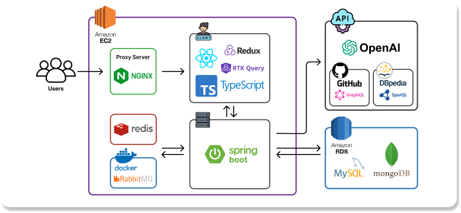

# Dev-Profile-Backend

## 서비스 소개

## Architecture

- 비정형 데이터와 정형화된 데이터들이 섞여서 나타나는 만큼 MongoDB와 MySQL을 혼용하여 사용함
- NGINX의 리버스 프록시 기능을 활용하여, 프론트 서버와 벡엔드 서버를 한 서버에 만들고, https 통신이 가능하도록 함
- GITHUB의 다양한 형태의 데이터를 받아오기 위해서 GraphQL과 RestAPI를 혼용해서 사용하여, 호출횟수와 응답시간을 크게 줄임

## Technical Challenge

>- 개발 초기에는 동기적으로 코드를 처리하여 속도가 매우 느렸다.
>- 비동기적인 처리를 처리 속도 향상 -> 트랜젝션 이슈로 인해 Patch데이터 소실 발생한다.
>- Message Queue를 활용하여, DB에 접근할 수 있는 트렌젝션의 숫자를 제한시켰다.
>- 비동기적인 처리를 통해 외부 API, 깃허브의 처리 속도를 향상시켰다.

>- GPT를 이용하여, Patch와 연관된 키워드를 뽑으면 지나치게 다양한 키워드를 제공하여, 자료처리를 하기가 적절하지 않았다.
>- 이런 키워드들을 컴퓨터공학 관련한 키워드들로 정리하고자 컴퓨터 공학 관련한 키워드로 사전생성의 필요성이 있었다.
>- DBpedia의 그래프 데이터베이스에서 "Computer Science", "Artificial Intelligence", "Programming Language"등을 시작점으로 하여 BFS로 탐색하여 65000개의 연관단어를 저장한다.
>- GPT의 생성된 키워드들을 Jaro-Winkler-Similarity를 통해 가장 가까운 단어로 만든다. 유사한 단어를 하나로 통합할 수 있다.
>- 사전에 존재하는 동의어들의 경우에는 DBpedia에서 제공하는 redirect기능을 활용하여 하나의 단어로 만들 수 있다. 이를 위해 SparQL을 이용하여 redirect한 단어로 바꿔준다.

